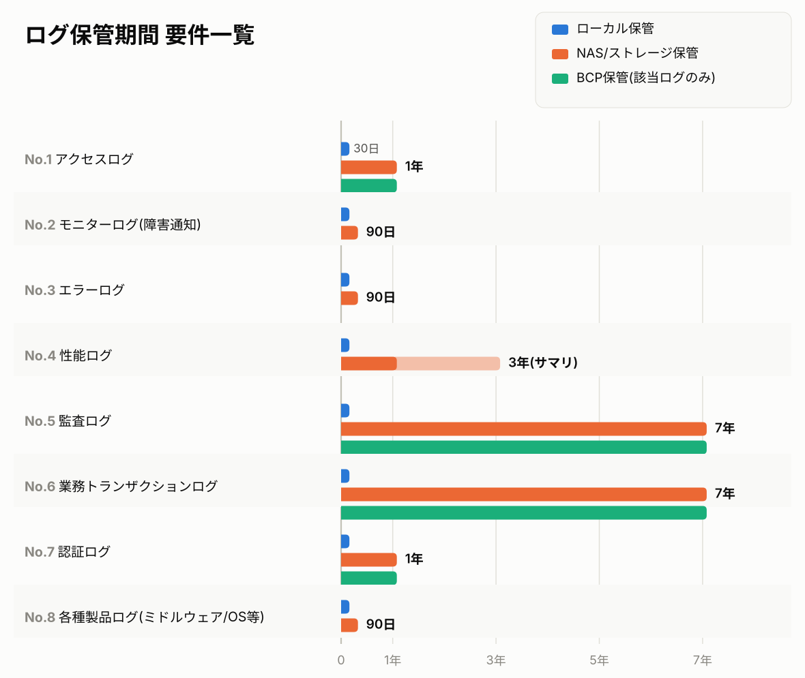

# backup-try

# ログのバックアップについて

- 要件や処理方式の例を用いて、バックアップを整理する。

## 要件一覧:ログ保管期間

| No | ログ種別 | オンライン保管期間(即時参照可能) | 長期保管期間(アーカイブ) | 保管媒体(長期) | BCP(遠隔地保管) | 保管期間の根拠(仮) |
|---|---|---|---|---|---|---|
| 1 | アクセスログ | 30日 | 1年 | NAS/ストレージ | 対象(オンライン伝送) | 不正アクセス調査の一般的な発覚期間を考慮 |
| 2 | モニターログ(障害通知) | 30日 | 90日 | NAS/ストレージ | 対象外 | 監視ツールで検知した障害の再発・傾向分析に必要な期間を考慮 |
| 3 | エラーログ | 30日 | 90日 | NAS/ストレージ | 対象外 | 障害解析・不具合の再発検証に必要な期間を考慮 |
| 4 | 性能ログ | 30日 | 1年(サマリは3年) | NAS/ストレージ | 対象外 | キャパシティプランニング・季節変動分析のため |
| 5 | 監査ログ | 30日 | 7年 | NAS/ストレージ | 対象(オンライン伝送) | 内部統制・会計帳簿関連法定保存年数を想定 |
| 6 | 業務トランザクションログ | 30日 | 7年 | NAS/ストレージ | 対象(オンライン伝送) | 取引記録の法定保存年数・紛争対応を想定 |
| 7 | 認証ログ | 30日 | 1年 | NAS/ストレージ | 対象(オンライン伝送) | 不正ログイン調査・内部統制要件を考慮 |
| 8 | 各種製品ログ(ミドルウェア/OS等) | 30日 | 90日 | NAS/ストレージ | 対象外 | 製品障害調査・ベンダーサポート対応に必要な期間 |



## 処理方式一覧表

| No | ログ種別 | 出力元 | ローテーション方式 | 夜間日次バックアップ処理 |
|---|---|---|---|---|
| 1 | アクセスログ(Webサーバ) | Webサーバ製品(Apache/Nginx等) | Webサーバ製品の標準機能(日次ローテーション、例:`CustomLog`+`rotatelogs`)。`access_yyyymmdd.log`として他ログと分離 | 当日分をNAS/ストレージへコピー→ローカル30日超過分削除 |
| 1 | アクセスログ(APサーバ) | APサーバのログ出力ライブラリ | ログ出力ライブラリの日次ローテーション設定(Logback/Log4j2の`TimeBasedRollingPolicy`)。`ap_access_yyyymmdd.log`として専用ファイルに出力 | 当日分をNAS/ストレージへコピー→ローカル30日超過分削除 |
| 2 | モニターログ(障害通知) | APサーバのログ出力ライブラリ | 監視ツール側の保持設定、またはログライブラリのサイズ/日次ローテーション。`alert.log`として専用ファイルに分離出力 | 当日分をNAS/ストレージへコピー→ローカル30日超過分削除 |
| 3 | エラーログ | APサーバのログ出力ライブラリ | ログ出力ライブラリの日次ローテーション設定(ログレベル`ERROR`のみ抽出出力)。`error_yyyymmdd.log`として専用ファイルに分離出力(アプリケーションログと混在させない) | 当日分をNAS/ストレージへコピー→ローカル30日超過分削除 |
| 4 | 性能ログ(レスポンスタイム) | Webサーバ/APサーバのアクセスログ | アクセスログ(No.1)の処理時間項目で表現(専用のログ出力・ローテーションは追加しない) | アクセスログ(No.1)のバックアップ処理に含める |
| 4 | 性能ログ(SQL実行時間) | APサーバのログ出力ライブラリ | ログ出力ライブラリの日次ローテーション設定。アプリケーションログの一部として出力(SQL実行時間を項目として含める) | 当日分をNAS/ストレージへコピー→ローカル30日超過分削除 |
| 4 | 性能ログ(OSリソース情報) | OSリソース監視機能/エージェント(CPU・メモリ等) | OS標準機能またはリソース監視エージェントの保持設定(サイズ/日次ローテーション)。`os_perf_yyyymmdd.log`として専用ファイルに分離出力 | 当日分をNAS/ストレージへコピー→ローカル30日超過分削除 |
| 5 | 監査ログ | APサーバのログ出力ライブラリ | DB側:`AUDIT`証跡テーブルからの日次抽出バッチ<br>AP側:ログ出力ライブラリの日次ローテーション。`audit_yyyymmdd.log`として専用ファイルに分離出力(改ざん検知用ハッシュ値を同時生成) | 当日分をNAS/ストレージへコピー→ローカル30日超過分削除 |
| 6 | 業務トランザクションログ | APサーバのログ出力ライブラリ | ログ出力ライブラリの日次ローテーション。`txlog_yyyymmdd.log`として専用ファイルに分離出力(トレースID/相関キーを含めて出力) | 当日分をNAS/ストレージへコピー→ローカル30日超過分削除 |
| 7 | 認証ログ | APサーバのログ出力ライブラリ | ログ出力ライブラリの日次ローテーション、またはIdP側の標準ログ機能。`auth_yyyymmdd.log`として専用ファイルに分離出力 | 当日分をNAS/ストレージへコピー→ローカル30日超過分削除 |
| 8 | 各種製品ログ(ミドルウェア/OS等) | 各ミドルウェア/OS標準機能 | 各製品の標準ローテーション機能(製品仕様に依存、個別に確認要)。製品標準の出力先ディレクトリ構成に従う(製品ごとに個別ファイル) | 当日分をNAS/ストレージへコピー→ローカル30日超過分削除 |


## ログ出力例

### 1.アクセスログ(Webサーバ)

Apache Combined Log Formatの例です。

​```
192.168.1.101 - - [12/Aug/2026:09:15:32 +0900] "GET /app/index.html HTTP/1.1" 200 5432 "-" "Mozilla/5.0 (Windows NT 10.0; Win64; x64)" 45231
192.168.1.102 - - [12/Aug/2026:09:15:33 +0900] "GET /app/css/style.css HTTP/1.1" 200 8210 "https://example.com/app/index.html" "Mozilla/5.0 (Windows NT 10.0; Win64; x64)" 12045
192.168.1.101 - - [12/Aug/2026:09:15:35 +0900] "POST /app/api/login HTTP/1.1" 302 0 "https://example.com/app/index.html" "Mozilla/5.0 (Windows NT 10.0; Win64; x64)" 187562
​```

### 1.アクセスログ(APサーバ)

Logback/Log4j2でのパターン出力例です(`[日時] [ログレベル] [トレースID] [ユーザーID] リクエスト情報 処理時間`)。

​```
2026-08-12 09:15:35.123 INFO [trace-8f3a2c1e] [user001] GET /api/accounts/12345 status=200 responseTime=812ms
2026-08-12 09:15:36.045 INFO [trace-9a1b4d2f] [user002] POST /api/transactions status=201 responseTime=1523ms
2026-08-12 09:15:37.891 WARN [trace-3c7e5a9b] [user001] GET /api/accounts/99999 status=404 responseTime=95ms
​```

### 2.モニターログ(障害通知)

```
2026-08-12 09:20:11.204 ALERT [alert-svc] ERR0901 DB接続エラーが発生しました host=apsv01 target=dbsv01 innerErrorCode=ORA-12541 detail="TNSリスナーに接続できません。DBサーバの状態を確認してください。"
2026-08-12 10:15:47.882 ALERT [alert-svc] ERR0902 外部システム通信エラーが発生しました host=apsv02 target=external-if-gw01 innerErrorCode=E-IF-0503 detail="外部インタフェースサーバへの接続がタイムアウトしました(timeout=30000ms)。"
```

### 3.エラーログ

```
2026-08-12 09:45:12.331 ERROR [trace-4d8e1a2c] [user003] com.example.batch.TransferService
Message : 口座振替処理中に例外が発生しました
AccountId : 1000234567
Operation : TRANSFER_EXECUTE
ErrorCode : E-TX-0021
Cause : java.sql.SQLException: ORA-00060: リソース・ビジー・タイムアウト(デッドロック待機)
StackTrace :
at com.example.batch.TransferService.executeTransfer(TransferService.java:142)
at com.example.batch.TransferService.process(TransferService.java:88)
at com.example.batch.BatchJobRunner.run(BatchJobRunner.java:53)
at java.base/java.lang.Thread.run(Thread.java:840)
Caused by : oracle.jdbc.OracleDatabaseException: ORA-00060 at line 1
```

### 4.性能ログ(SQL実行時間)

```
2026-08-12 09:15:35.201 INFO [trace-8f3a2c1e] [user001] SQL_EXEC table=ACCOUNTS operation=SELECT execTime=45ms rowsFetched=1
2026-08-12 09:15:36.078 INFO [trace-9a1b4d2f] [user002] SQL_EXEC table=TRANSACTIONS operation=INSERT execTime=312ms rowsAffected=1
```

### 4.性能ログ(OSリソース情報)

```
2026-08-12 09:00:00.000 PERF host=apsv01 cpuUsage=42.5% memUsage=68.2% diskUsage=55.0% diskIoWait=3.1%
2026-08-12 09:05:00.000 PERF host=apsv01 cpuUsage=78.9% memUsage=71.4% diskUsage=55.0% diskIoWait=8.7%
2026-08-12 09:10:00.000 PERF host=dbsv01 cpuUsage=61.3% memUsage=84.6% diskUsage=72.3% diskIoWait=12.4%
```

### 5.監査ログ

```
2026-08-12 09:12:03.114 AUDIT [trace-2f9c6b1a] userId=user001 role=branch_manager action=UPDATE target=account:1000234567 field=creditLimit oldValue=500000 newValue=800000 result=ALLOW hash=8a3f1c9e...
2026-08-12 09:14:27.559 AUDIT [trace-7b2e4d0f] userId=user045 role=teller action=REFERENCE target=account:1000987654 result=ALLOW hash=1d4b7a2f...
2026-08-12 09:18:52.907 AUDIT [trace-5a1d9c3e] userId=user012 role=teller action=UPDATE target=account:1000112233 field=balance result=DENY reason=INSUFFICIENT_PRIVILEGE hash=6e9f0b3c...
```

### 6.業務トランザクションログ

```
2026-08-12 09:10:12.334 TX [trace-2c8f4a1e] [guest] txId=TX20260812-000201 type=MEMBER_APPLY status=COMPLETE userId=user00891 applyNo=APP2026081200145 note="新規会員申込によりユーザID・申込番号を採番"
2026-08-12 09:22:47.809 TX [trace-9d1b6e3f] [user00891] txId=TX20260812-000202 type=EXTERNAL_API_CALL status=START target=external-if-gw01 apiName=receptionRegister requestNo=REQ2026081200078
2026-08-12 09:22:48.612 TX [trace-9d1b6e3f] [user00891] txId=TX20260812-000202 type=EXTERNAL_API_CALL status=COMPLETE target=external-if-gw01 apiName=receptionRegister receptionNo=RCPT2026081200432
```

### 7.認証ログ

```
2026-08-12 08:59:41.203 AUTH [trace-1a3f7c9d] userId=user001 event=LOGIN result=SUCCESS sourceIp=192.168.1.101 method=PASSWORD
2026-08-12 09:02:15.667 AUTH [trace-6d2b8e4a] userId=user099 event=LOGIN result=FAILURE sourceIp=203.0.113.45 method=PASSWORD reason=INVALID_PASSWORD attemptCount=3
2026-08-12 09:30:08.412 AUTH [trace-9f4a1c7b] userId=user001 event=LOGOUT result=SUCCESS sourceIp=192.168.1.101
```


